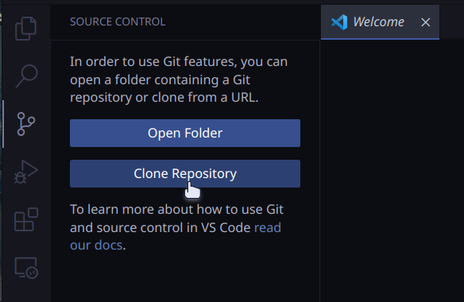
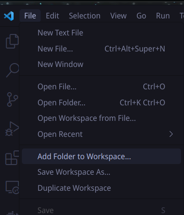

# Projecto 3 - Bases de Datos 2

## ¿Cómo inicializar el projecto?

1. [Crea un fork de este repositorio](https://github.com/dialvarezs/db2-full-stack/fork)
2. Clona el repositorio forkeado desde Visual Studio Code

   
3. Seguir las instrucciones tanto de [Frontend](db2-frontend/README.md) como de [Backend](db2-backend/README.md) para
   inicializar parte del proyecto.

### Importante

Dado que este proyecto considera tanto backend como frontend, es necesario abrir cada uno de ellos de manera
independiente para que Visual Studio pueda reconocer correctamente el tipo de proyecto y el entorno.

Esto se puede lograr de dos formas:

#### Opción A

Abrir cada carpeta (`db2-backend` y `db2-frontend`) por separado en ventanas diferentes de Visual Studio Code.

#### Opción B

Abrir primero la carpeta `db2-backend` y luego utilizar la opción `File > Add Folder to Workspace...` para agregar la
carpeta `db2-frontend` al mismo espacio de trabajo.

